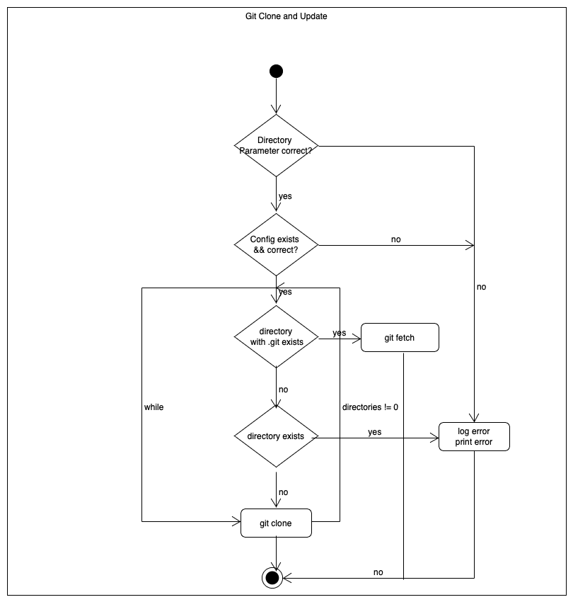

# Projekt Dokumentation

[[_TOC_]]

## Lösungsdesign
Anhand der Analyse wurde folgendes Lösungsdesign entworfen.

### Aufruf der Skripte

### Script 1
When calling the script, only the destination directory must be specified. You can define the destination where the target directory will be located with `-d`  (Base directory) tag. 

If you want it to be called regularly, you can define the script in a CronJob.

### Script 2
When calling the script only two params are needed. The location of the directory that contains the cloned repositories and name of the output file. 

To define the directory use the `-d` tag and with `-o` it is possible to define the location, name and file ending of the output file. By default the file gets put into the current working directory named `gitLog.csv`.

This script can be called using the following command `python3 git_extract_commits.py -o /home/root/result.csv -d /home/root/GitHub`. 

### Ablauf der Automation
The following section shows the UML Activity Diagrams of our scripts.

### Script 1

 

### Script 2
 

### Konfigurationsdateien

### Script 1 
The configuration file can be found under `etc/`. It is called `gitrepo.conf`.  There is also a `gitrepo.conf.sample` file. 

The following must be in the config file.

```
git@github.com:dmtbz/m122_mitrovic_mohammed.git Danilo_Mitrovic_Mahbube_Shafin_Mohammed
<git_repo_url> <directory_name>

```


### Script 2
This script does not need a config file.

## Abgrenzungen zum Lösungsdesign

TODO: Nachdem das Programm verwirklicht wurde hier die unterschiede von der Implemenatino zum Lösungsdesign beschreiben (was wurde anders gemacht, was wurde nicht gemacht, was wurde zusaetzlich gemacht)